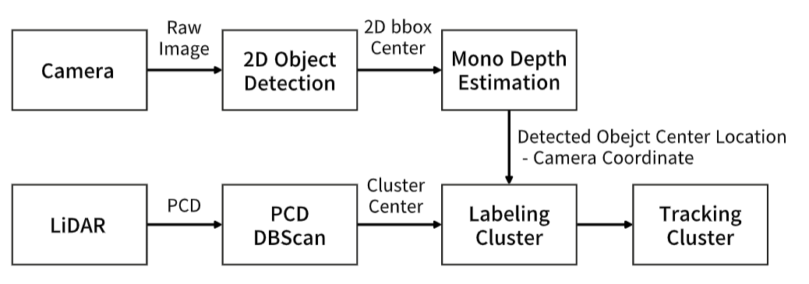

# 3D Object detection & Tracking lidar pcd cluster

## Team 4 final project

## About Project

This project was initiated to address the issue of limited situational awareness from the narrow field of view of the forward-facing camera installed in vehicles. The ultimate goal is to develop a stable driving environment by enhancing the ability to respond to the overall surrounding situation. To achieve this, the project aims to complement the camera's field of view by utilizing Sensor Fusion to detect objects beyond its scope and enhancing situational awareness through LiDAR Point Cloud Clustering.

### Pipe line
  

## Installation
For installation you can use modules in this package
```bash
python setup.py develop
```

## Quickstart

```bash
python main.py --data_path {DATASET_DIR}
```

```
 ─dataset
   ├─calib
   ├─image_2
   ├─label_2
   └─save
```

## Requirements

* QT 5.4
* TBB 4.3
* Eigen 3.2.9
* Python 2.7+ or 3.6+
* Numpy 1.13
 
## Reference
- [YOLOv5 by Ultralytics](https://github.com/ultralytics/yolov5)
- [Yolo3D](https://github.com/ruhyadi/YOLO3D)
- [shakdem/3D-BoungingBox](https://github.com/skhadem/3D-BoundingBox)
- [dtc-KITTI-For-Beginners](https://github.com/dtczhl/dtc-KITTI-For-Beginners)
- [KITTI dataset](http://www.cvlibs.net/datasets/kitti)

[](https://opensource.org/licenses/MIT)
&nbsp;
[](https://www.codacy.com/app/dtczhl/dtc-KITTI-For-Beginners?utm_source=github.com&amp;utm_medium=referral&amp;utm_content=dtczhl/dtc-KITTI-For-Beginners&amp;utm_campaign=Badge_Grade)

```
@misc{mousavian20173d,
      title={3D Bounding Box Estimation Using Deep Learning and Geometry}, 
      author={Arsalan Mousavian and Dragomir Anguelov and John Flynn and Jana Kosecka},
      year={2017},
      eprint={1612.00496},
      archivePrefix={arXiv},
      primaryClass={cs.CV}
}
```
